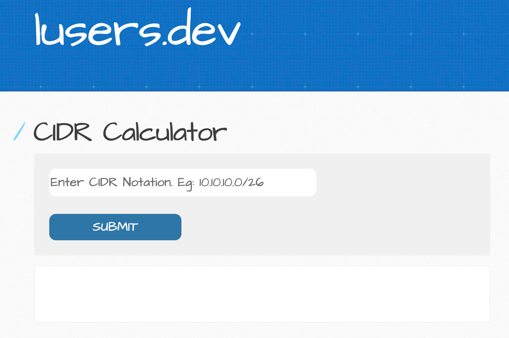

# flask-ipcalc

Simple Flask Web App: CIDR Calculator

## Screenshot Sample
<p align="center">



## Prerequisites
```
git

pipenv
```


## How-To with Pipenv 

```
$ pipenv install

$ pipenv shell


$ flask run                                                                
 * Environment: production
   WARNING: This is a development server. Do not use it in a production deployment.
   Use a production WSGI server instead.
 * Debug mode: off
 * Running on http://127.0.0.1:5000/ (Press CTRL+C to quit)

```

## How-To with Docker

```
## view/edit Dockerfile

## build image
docker build -t flask_ipcalc .

# run container
docker container run --name flask_ipcalc --detach --publish 5000:5000 flask_ipcalc:latest
```

```
## access container
curl http://127.0.0.1:5000

```

```
## teardown container
docker container rm -f $(docker container ls -aq -f name=flask_ipcalc) 

## teardown image
docker image rm -f $(docker image ls -aq -f reference='flask_ipcalc*')

```
 

